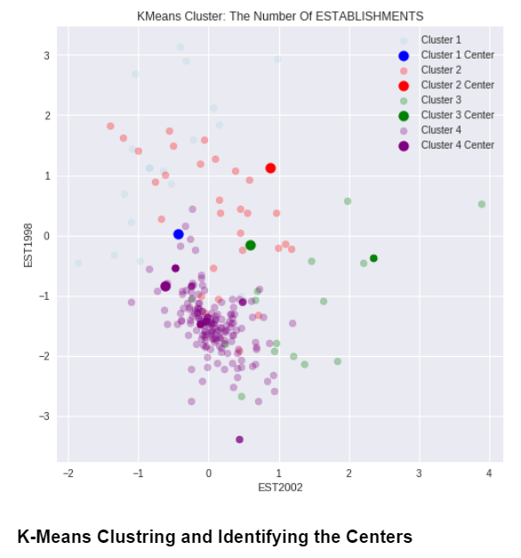
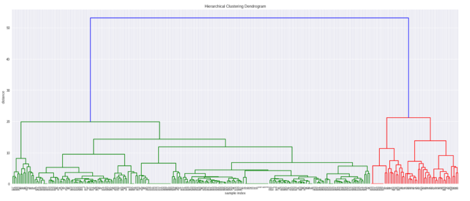
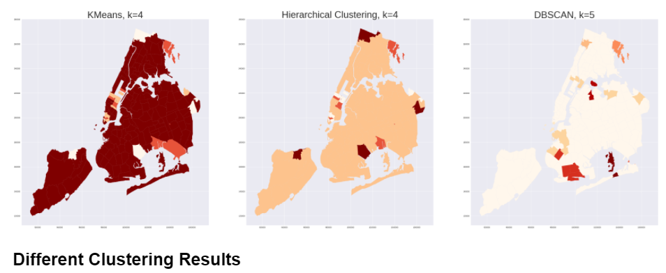
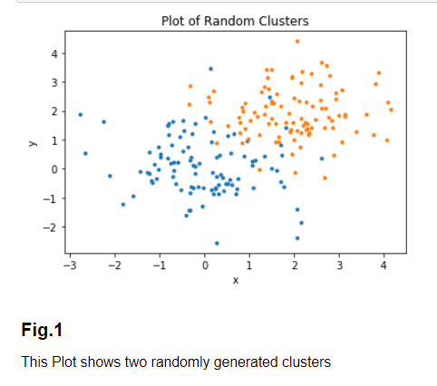
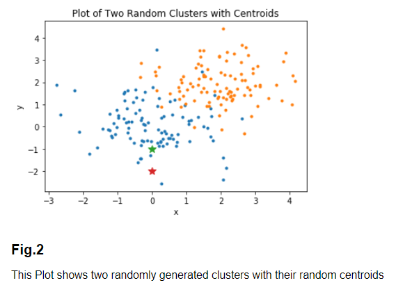
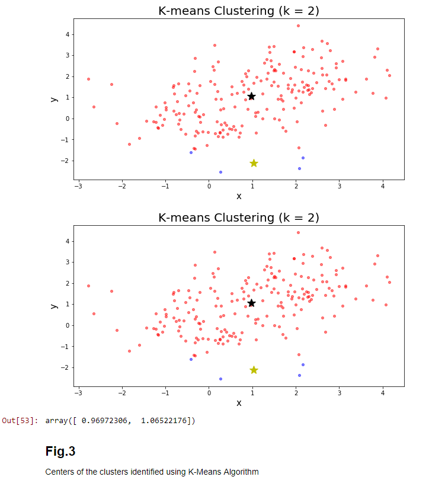

Part-1: Time Series Clustering:

Performed Time Series Clustring using K-Means. Hierarchial Aggloromative Clustering and DBSCAN.

[Part-2: Implement K-Means Algorithm](http://stanford.edu/~cpiech/cs221/handouts/kmeans.html)

K-Means Clustering

K-Means clustering intends to partition n objects into k clusters in which each object belongs to the cluster with the nearest mean. This method produces exactly k different clusters of greatest possible distinction. The best number of clusters k leading to the greatest separation (distance) is not known as a priori and must be computed from the data. The objective of K-Means clustering is to minimize total intra-cluster variance, or, the squared error function: 		

Algorithm
Clusters the data into k groups where k  is predefined.
Select k points at random as cluster centers.
Assign objects to their closest cluster center according to the Euclidean distance function.
Calculate the centroid or mean of all objects in each cluster.
Repeat steps 2, 3 and 4 until the same points are assigned to each cluster in consecutive rounds.

K-Means is relatively an efficient method. However, we need to specify the number of clusters, in advance and the final results are sensitive to initialization and often terminates at a local optimum. Unfortunately there is no global theoretical method to find the optimal number of clusters. A practical approach is to compare the outcomes of multiple runs with different k and choose the best one based on a predefined criterion. In general, a large k probably decreases the error but increases the risk of overfitting.		
 		
Example:		
Suppose we want to group the visitors to a website using just their age (a one-dimensional space) as follows:		
15,15,16,19,19,20,20,21,22,28,35,40,41,42,43,44,60,61,65		
Initial clusters:		
Centroid (C1) = 16 [16]
Centroid (C2) = 22 [22]		
Iteration 1:		
C1 = 15.33 [15,15,16]
C2 = 36.25 [19,19,20,20,21,22,28,35,40,41,42,43,44,60,61,65]		
Iteration 2:		
C1 = 18.56 [15,15,16,19,19,20,20,21,22]
C2 = 45.90 [28,35,40,41,42,43,44,60,61,65]		
Iteration 3:		
C1 = 19.50 [15,15,16,19,19,20,20,21,22,28]
C2 = 47.89 [35,40,41,42,43,44,60,61,65]		
Iteration 4:		
C1 = 19.50 [15,15,16,19,19,20,20,21,22,28]
C2 = 47.89 [35,40,41,42,43,44,60,61,65]		
 		
No change between iterations 3 and 4 has been noted. By using clustering, 2 groups have been identified 15-28 and 35-65. The initial choice of centroids can affect the output clusters, so the algorithm is often run multiple times with different starting conditions in order to get a fair view of what the clusters should be.

